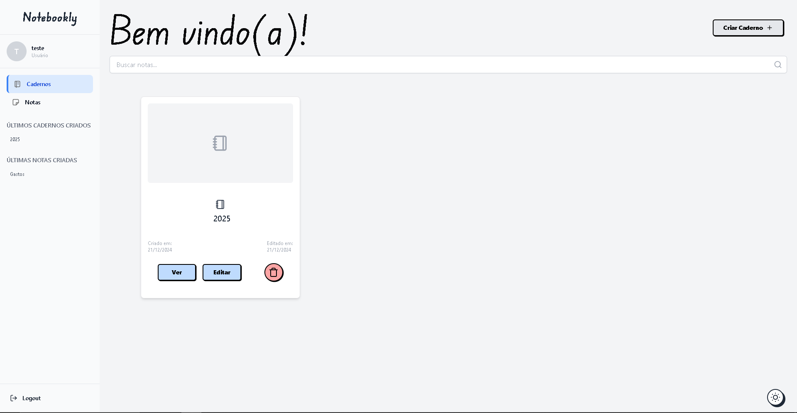

# Notebookly

Notebookly é um projeto que simula um diário digital. O objetivo é permitir que o usuário crie cadernos e notas, podendo registrar seus sentimentos e pensamentos em cada nota criada.

## Funcionalidades

- **Criar Cadernos**: Organize suas notas em diferentes cadernos, facilitando a gestão de temas ou projetos.
- **Adicionar Notas**: Crie notas dentro dos cadernos, registrando seus pensamentos ou informações importantes.
- **Sentimentos**: Em cada nota, você pode adicionar um sentimento (como feliz, triste, etc.), proporcionando uma visão mais emocional sobre o que você escreveu.
- **Autenticação**: O projeto utiliza o NextAuth para garantir que cada usuário tenha um espaço seguro para armazenar suas notas.

## Tecnologias Utilizadas

- **Next.js**: Framework React para criar aplicações web modernas.
- **Prisma**: ORM para interagir com o banco de dados.
- **NextAuth.js**: Autenticação fácil e segura para Next.js.
- **Tailwind CSS**: Framework de design para uma interface moderna e responsiva.
